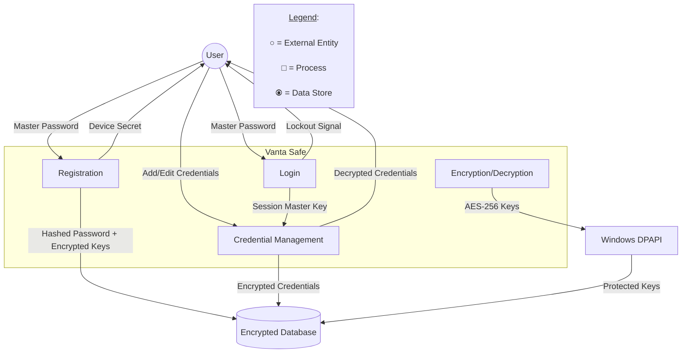
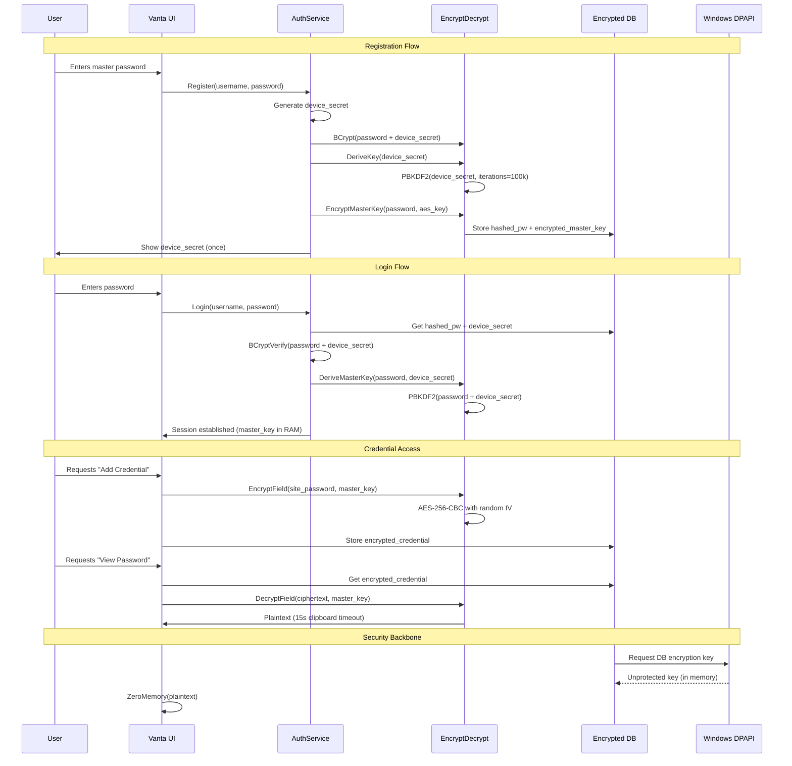

# 🔒 Vanta Safe - Ultimate Password Protection  

**Your digital vault for bulletproof password management**  

[](https://drive.google.com/uc?export=download&id=1zH80TK4tHPl1lGcNU58NW5-hKX2IP78C)  

---

## 🌟 Why Choose Vanta Safe?  

✅ **Military-grade encryption** (AES-256 + BCrypt + PBKDF2)  
✅ **100% offline** - Your data never leaves your computer  
✅ **Brute force protection** - Auto-lock after 5 failed attempts  
✅ **Secure recovery** - Device-secret based account restoration  
✅ **Clipboard protection** - Auto-clears passwords after 15 seconds  

---


## 🚀 Getting Started  

1. **Download** the installer above  
2. **Install** with one click  
3. **Register** with a strong master password  
4. **Securely store** all your credentials  

---

## 🔐 Security Architecture  

### Encryption Workflow  
<pre lang="markdown"> ```mermaid graph TD A[Master Password] --> B(BCrypt Hashing) C[Device Secret] --> B B --> D[Secure Database Storage] A --> E(PBKDF2 Key Derivation) C --> E E --> F[AES-256 Encryption] F --> G[Encrypted Credential Storage] style A fill:#86C7F3,stroke:#333,stroke-width:2px style B fill:#B6D7A8,stroke:#333,stroke-width:2px style C fill:#86C7F3,stroke:#333,stroke-width:2px style D fill:#B6D7A8,stroke:#333,stroke-width:2px style E fill:#86C7F3,stroke:#333,stroke-width:2px style F fill:#B6D7A8,stroke:#333,stroke-width:2px style G fill:#86C7F3,stroke:#333,stroke-width:2px ``` </pre>

### DATA Workflow

### Sequence Diagram



## Attack Prevention
🛡️ SQL Injection: Parameterized queries

💣 Brute Force: Account lockout + slow hashing

👀 Shoulder Surfing: Masked password fields

📋 Clipboard Risks: Auto-clear mechanism

## 🖥️ Key Features
Feature	Description
Zero-Knowledge	We never see/store your passwords
Secure Search	Find credentials without full decryption
Password Generator	Built-in strong password creator
Cross-Device Sync	(Future) Encrypted cloud sync
## 📦 Installation
Windows x64 (.NET 8.0 Required)
Click the Download Installer button above

Run VantaSafe_Setup.exe

Follow the simple wizard (takes < 1 minute)

Launch from your Start Menu

## ℹ️ System Requirements:

Windows 10/11 (64-bit)

.NET 8.0 Runtime

50MB disk space

## 🆘 Recovery Process
If locked out:

Click "Recover Account"

Enter your username and device secret

## Regain access securely

🔑 Your device secret was shown during registration - store it safely!

📜 Changelog (v2.1)
⬆️ Upgraded to .NET 8.0

🏷️ Added explicit x64 support

🚀 Optimized installer package

## 🛡️ Enhanced encryption routines

# 🤝 Contribute
Found an issue? Want to improve security?
Open an Issue

💎 Your Security Is Our Top Priority
"In a world of digital threats, Vanta Safe stands guard"

Download Now

Offline • Secure • Uncompromising

